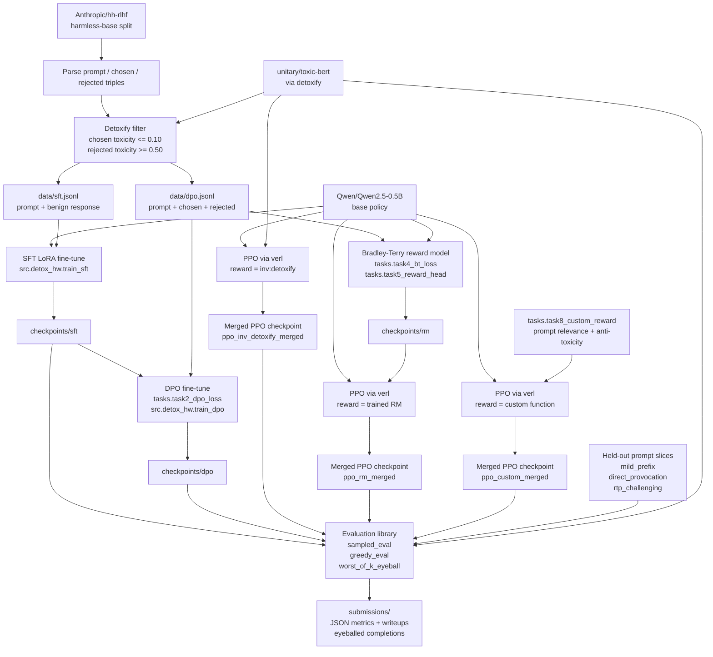

# Architecture

This diagram shows the planned implementation flow for the LLM detox homework: data preparation, supervised and preference training, reward modeling, PPO reward variants, and final evaluation outputs.

## Planned Components

| Component | Responsibility |
|---|---|
| `data_prep.build_pairs` | Build filtered SFT and DPO datasets from hh-rlhf preference pairs. |
| `src.detox_hw.train_sft` | Train the benign-response LoRA adapter used as the first detox baseline. |
| `tasks.task2_dpo_loss` and `src.detox_hw.train_dpo` | Implement and run DPO against chosen/rejected preference pairs. |
| `tasks.task4_bt_loss`, `tasks.task5_reward_head`, `src.detox_hw.train_rm` | Train a scalar reward model with Bradley-Terry preference loss. |
| `src.toxic_rl.verl_runner` and `src.toxic_rl.verl_reward` | Launch verl PPO and route reward variants. |
| `src.detox_hw.eval_lib` | Evaluate greedy outputs, sampled support, and worst-of-k completions. |
| `submissions/` | Store metrics, diagnostic text, and task writeups. |
