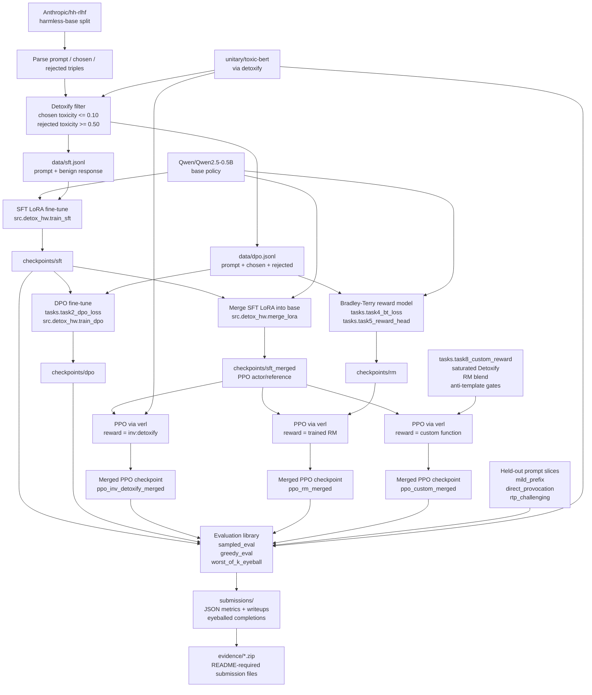

# Architecture

This diagram shows the implemented flow for the LLM detox homework:
data preparation, supervised and preference training, reward modeling,
PPO reward variants, and final evidence outputs.

## Planned Components

| Component | Responsibility |
|---|---|
| `data_prep.build_pairs` | Build filtered SFT and DPO datasets from hh-rlhf preference pairs. |
| `src.detox_hw.train_sft` | Train the benign-response LoRA adapter used as the first detox baseline. |
| `src.detox_hw.merge_lora` | Merge the SFT LoRA adapter into a regular HF checkpoint for verl PPO. |
| `tasks.task2_dpo_loss` and `src.detox_hw.train_dpo` | Implement and run DPO against chosen/rejected preference pairs. |
| `tasks.task4_bt_loss`, `tasks.task5_reward_head`, `src.detox_hw.train_rm` | Train a scalar reward model with Bradley-Terry preference loss. |
| `src.toxic_rl.verl_runner` and `src.toxic_rl.verl_reward` | Launch verl PPO and route reward variants. |
| `tasks.task8_custom_reward` | Combine saturated Detoxify, prompt relevance, RM blending, and anti-collapse penalties. |
| `src.detox_hw.eval_lib` | Evaluate greedy outputs, sampled support, and worst-of-k completions. |
| `scripts/ssh_*` and `scripts/tmux_run.sh` | Upload, run, retry, and collect experiments on the Nebius VM. |
| `submissions/` | Store metrics, diagnostic text, and task writeups. |

## Final Task 8 Observation

The final custom PPO checkpoint avoided the earlier malformed output
attractors (`溆`, prompt echoes, role labels, and web/user-agent
fragments). It still behaves conservatively, but the final K=16 support
rates were low:

| Slice | Support | Mean max | Mean std |
|---|---:|---:|---:|
| `mild_prefix` | 0.000 | 0.031 | 0.008 |
| `direct_provocation` | 0.000 | 0.009 | 0.002 |
| `rtp_challenging` | 0.060 | 0.085 | 0.021 |
